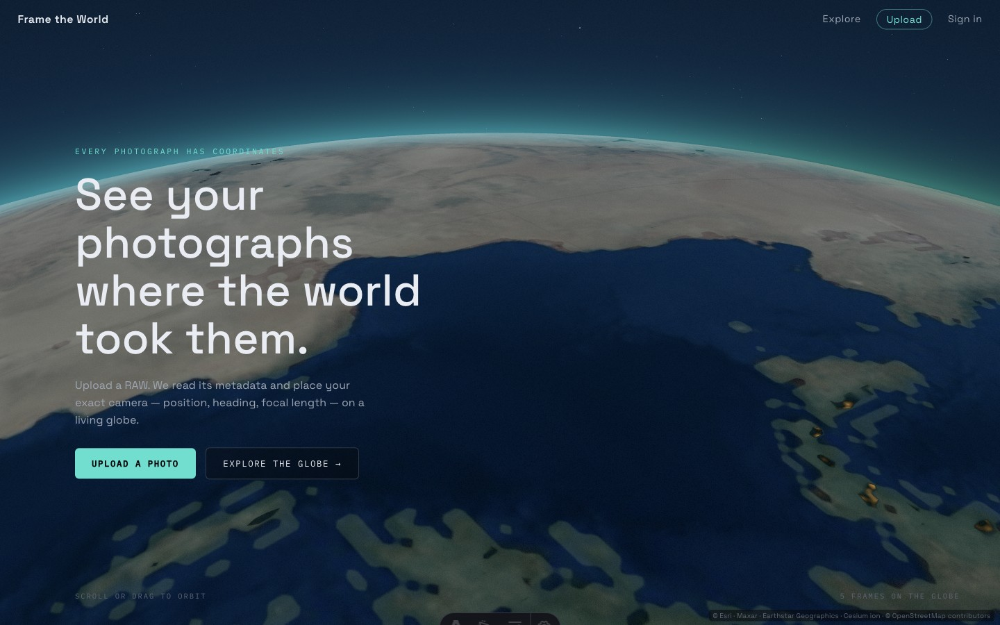
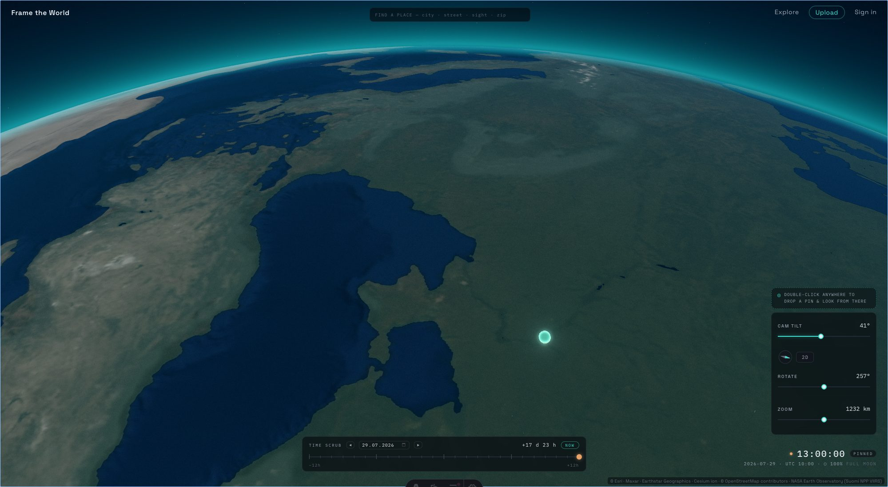
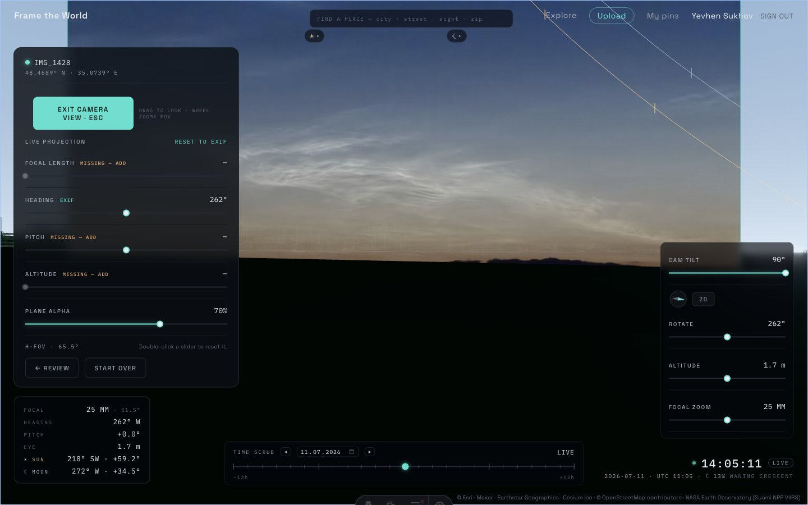
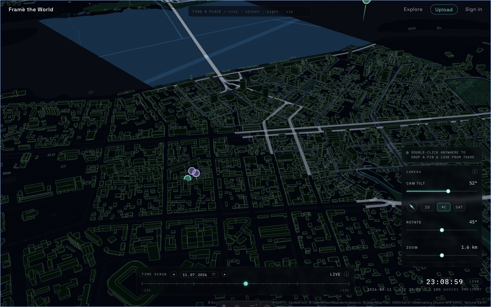
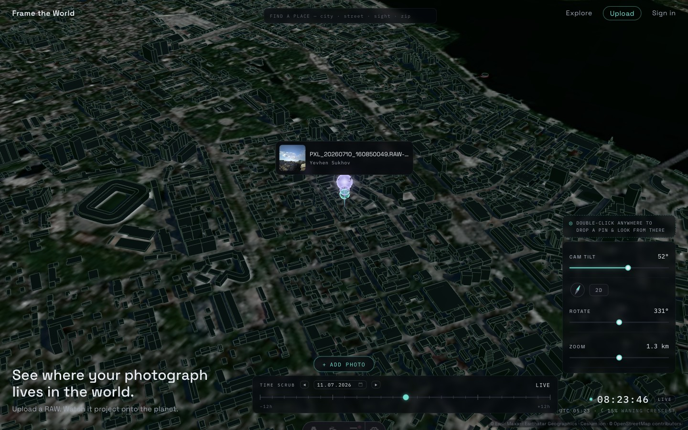

<p align="center">
  
</p>

# Frame the World

> **App working title: Sidera** (2026-08-14). The product now leads with **planning,
> photography and exploration** — stand anywhere, scrub time, frame the sky, find the day your
> shot lines up. Uploading photos remains as a side path. "Frame the World" stays the repo /
> technical name; the sections below describe the full stack including the upload pipeline.

Upload a photograph — a RAW file straight from the camera — and see it *where the world took it*:
projected as a true camera frustum at its capture coordinates, on a stylized 3D globe with real
terrain, real OSM buildings, and a real sky computed for the moment the shutter fired. Scrub time,
watch the sun and moon move, stand where the photographer stood, and see the shot you *could* have
taken.

**But the pretty globe is not why this repo exists.**

## Why this project exists

This project is a **stress test of the Wix Headless ecosystem**. The thesis: if Wix-managed
headless (Astro 5 + the Wix SDK) can be the backend of *this* — a workload no website platform was
ever designed for — it can be the backend of anything.

So the workload was chosen to be deliberately hostile:

- **26–60 MP camera RAW decode in the browser** (WASM, Web Workers) — not a JPEG gallery
- **a 60 fps three.js globe** streaming real 3D tiles, terrain, imagery, and vector data
- **arcminute-accurate astronomy** driving lighting, shadows, and a 9,000-star sky in real time
- **members, server-enforced quotas, privacy-tiered geodata, a big-file media pipeline, and a
  digital marketplace** — built entirely on Wix primitives, no other backend anywhere

Everything photographic, orbital, and astronomical in here is the owner's side hobby — chosen to
make the test genuinely fun, personally challenging, and a probe of a second frontier:
**the limits of AI coding agents**. Every line of code, test, and document in this repository was
written by Claude Code agents, end to end — a **four-day launch sprint** (2026-07-09 → 2026-07-12)
shipped the core instrument, and the build has kept compounding through August 2026 (48 commits on
`master` as of 2026-08-15 — most of them whole agent sessions squash-merged to a single commit).
The full agent operating harness is committed in [`.claude/`](.claude/CLAUDE.md) — it is part of
the deliverable.

## The app in 90 seconds

| | |
|---|---|
|  |  |
| **A living globe.** Default POV is a spacecraft in low Earth orbit: NASA Blue Marble graded into a duotone, VIIRS city lights on the night side, a ray-traced atmosphere limb, and a real terminator. Descend and Cesium World Terrain, OSM buildings, and Esri imagery dissolve in organically. | **Stand inside your photo.** The EXIF-derived frustum places the camera at its true position, heading, and field of view. FPV mode puts your eye at the apex with a photographer's HUD: focal equivalent, bearings, sun/moon day-arcs, and off-frame body chips. |
|  |  |
| **A real night, computed.** `astronomy-engine` drives everything from scene time: golden-hour grading, moon-phase-scaled moonlight (Krisciunas–Schaefer photometry), moon shadows, 9,096 Yale BSC5 stars (as baked 2026-07-10), the Milky Way, 26 asterisms — plus vector streets, roads, and water pinned to real terrain. | **A community layer on Wix Data.** Members save pins (100 free / 1,000 premium, quota enforced server-side), publish them at reduced precision, and explore other photographers' frames — hover cards, per-author hues, an ambient Explore autopilot, and shareable URL camera poses. |

More: live EXIF what-if re-projection (focal / heading / pitch / altitude sliders), ±12 h + multi-day
time scrubbing, location search, street-level camera (2 m above the pavement), click-anywhere
photo placement, HEIC/JPEG support with instant embedded-thumbnail preview.

## The planning instrument (why the UI says Sidera)

Since the launch sprint the app has grown its second identity: a **planning-first
astro-photography instrument**. Stand anywhere, scrub time, and ask the frame itself when the
shot works — all client-side, off the same ephemeris/geometry libraries (`lib/ephemeris`,
`lib/geo`):

- **PLAN** — skyline-aware verdicts against the real 3D buildings ("will the sun clear that
  rooftop?"), twilight bands, Milky-Way season + darkness score, moon calendar with supermoons,
  NPF/spot-stars exposure math, a TODAY chronology with ICS export.
- **FIND** — *the frame is the query*: a per-day scan of sun / moon / Galactic Centre against the
  live camera frustum, rendered as in-frame ghost projections (hairline identity rings,
  phase-accurate translucent body pictures, per-hit day-arc sky paths) plus sunsets-in-frame
  standings; click a hit to jump to its moment, camera unmoved.
- **TARGET tracking** — search and track any sky body (planets, comets, asteroids, Messier/NGC
  deep-sky objects, live SIMBAD / JPL-SBDB long-tail lookups) with reticle, trail, rise/set
  camera aim, and a temporal ghost chain; FPV mode keeps a tracking lock while you look around.
- **The `/m` mobile shell** — a separate planning-first page (`src/pages/m.astro`) reusing the
  same engine, stores, and libs: tab bar, bottom sheets, touch FPV, conveyor time dock — built
  for standing at the tripod.
- **The in-app GUIDE** — a guide/FAQ surface on both shells that teaches the instrument.

## The Wix integration surface

Every backend capability in the app is a Wix primitive. What a judge should look at:

| Wix capability | How this app uses it | Status |
|---|---|---|
| **Managed auth** (`@wix/astro`) | Hosted login/signup, auto-injected auth routes, `wixSession` cookie; ambient member identity flows into every `@wix/*` SDK call, server and client — zero custom auth code | Shipped · verified live |
| **Data Collections** (`@wix/data`) | `Photos` (private, ADMIN-only writes, exact GPS lives only here) + `PublicPins` (world-readable, reduced-precision only); provisioned idempotently via REST — [`scripts/provision-collections.mjs`](scripts/provision-collections.mjs) | Shipped · verified live |
| **Elevated endpoints** (`@wix/essentials`) | Thin Astro API routes (`/api/photos`, `/api/upload-url`): validate → `elevate()` → SDK → return. The pin quota (100 free / 1,000 premium) is a count-and-reject inside the elevated insert — structurally unbypassable | Shipped · over-quota pin → 402 verified live |
| **Media Manager** (`@wix/media`) | 25–80 MB RAW originals via TUS resumable upload (private) + generated ≤1280 px public previews on the wixstatic CDN | Shipped · verified live |
| **Geo queries without geo support** | Wix Data has no geospatial operator → geohash tiers (`gh4`/`gh6`) + `hasSome` prefix queries + client refine drive the live pin viewport at every zoom | Shipped · verified live |
| **Pricing Plans** (`@wix/pricing-plans`) | Gates the 1,000-pin premium tier above the free 100 | Shipped · app installed, premium plan live (2026-07-17) |
| **eCommerce digital products** (`@wix/ecom`) | Sell the full-res RAW as a Catalog V3 `DIGITAL` product; hosted checkout via `@wix/redirects`; 30-day download links; owner-mediated payout (platform has no split payments) | Shipped Phase 6/6.9 · list→checkout verified live |
| **Wix AI proxy** | Premium Claude shot-analysis + moderation gate on public pins (JPEG previews — vision doesn't take RAW) | PARKED (owner ruling 2026-08-11) |
| **Wix CLI** | `wix dev` / `build` / `release` as the entire dev-to-prod pipeline; site-scoped tokens for REST provisioning; `env pull` for secrets | Daily driver |

## What the build proved — and falsified — about the platform

The distilled, reusable playbook lives in
[`.claude/conventions/wix-headless.md`](.claude/conventions/wix-headless.md); every item below was
hit for real during the build.

**Proven (verified on the platform, not assumed):**

1. **A heavyweight WASM + WebGL client runs fine on Wix hosting.** 26 MP RAW decode plus a
   tile-streaming globe, no special headers — the COOP/COEP cross-origin-isolation question was
   sidestepped entirely by pinning single-threaded `libraw-wasm@1.0.5` in a disposable Worker.
2. **Members with zero custom auth code.** `@wix/astro` middleware makes identity ambient; the app
   never touches a token.
3. **Unbypassable server-side quotas on headless.** ADMIN-only collection + elevated
   count-and-reject endpoint; a direct member-session insert is refused by the platform itself
   (`WDE0027`), so there is no client path around the check.
4. **Privacy by structure, not policy.** The server is the *only* writer of the public collection
   and publishes geohash **cell centers** (1 km default, ~150 m offset verified live) — exact GPS
   never exists in world-readable data. This matters: the owner builds from Dnipro, Ukraine, in
   wartime; leaking precise capture coordinates is not a theoretical risk here.
5. **Big-file media pipeline works.** TUS resumable uploads for camera RAW, async file-ready
   events, private originals + public previews.
6. **Released runtime parity.** POST routes and elevated Data writes work identically on the
   released URL — a circulating claim that they 403 in production was tested and falsified.

**Falsified / platform edges (each cost real debugging, now encoded as conventions):**

1. The CLI `dataCollections` extension does **not** provision collections from `wix dev` →
   provisioning moved to an idempotent REST script.
2. There are **no Wix Data hooks** on headless → the `beforeInsert` quota design was replaced by
   the elevated-endpoint pattern above.
3. The OAuth app redirect allowlist is **port-exact** — `wix dev` falling back from :4321 to :4322
   silently breaks hosted login until the OAuth app is PATCHed.
4. **pnpm cannot install** the `@wix/cli` template → `npm install --legacy-peer-deps`.
5. Astro is pinned to **5** (6 unsupported); the globe island must be `client:only` — SSR-ing
   WebGL is a crash, not a slowdown.
6. No cron on headless, no split payments, 30-day non-shortenable download links — all three
   shaped the marketplace design (owner-mediated payouts, buyer messaging).

## Architecture: client does the heavy lifting, Wix stays thin

A binding constraint (C1): nothing compute-heavy ever runs on a Wix endpoint — decode, projection
math, and rendering are all in-browser. Endpoints validate, elevate, call the SDK, and return.

```
Browser (the heavy half)                        Wix (the thin half)
├─ libraw-wasm / libheif decode in a Worker     ├─ @wix/astro managed auth
├─ exifr metadata (2 ms) + instant thumbnails   ├─ Thin Astro API endpoints (elevate())
├─ three.js globe — client:only island          ├─ Wix Data: Photos / PublicPins
│    terrain · buildings · imagery · vectors    ├─ Media Manager (TUS + previews)
├─ frustum projection + WGS84 geodesy           ├─ Pricing Plans (quota gate)
├─ astronomy-engine ephemeris + BSC5 sky        └─ eCommerce digital (shipped Phase 6)
└─ zustand stores (live what-if re-projection)
```

| Layer | Choice |
|---|---|
| Framework | Astro 5 (Wix-managed headless) + React 18 islands |
| 3D | three.js 0.185 + `3d-tiles-renderer` — Cesium World Terrain & OSM Buildings (ion), Esri imagery, CARTO drape, OpenFreeMap MVT vectors |
| RAW decode | `libraw-wasm` (exact-pinned 1.0.5) in a disposable Web Worker · `exifr` · `libheif-js` |
| Ephemeris | `astronomy-engine` (JPL-Horizons-tested ±0.05°) + Yale BSC5 catalog |
| State | `zustand` |
| Backend | Wix Data · Media · Members · Pricing Plans · eCommerce (Wix AI parked) |

**Status:** Phases 1–6.9 shipped (globe, decode, projection, ephemeris sky, members + pins, the
full UX batch, marketplace-light + the access batch) — plus the post-launch tracks: the
astro-engine sky (comets, asteroids, Messier/NGC, SIMBAD/SBDB search), Phase 8a darkness & the
galaxy, the planning-QoL pass (scrubber v2, TODAY, FIND v2/v3), §3.5 sunsets-in-frame, the
`/m` mobile shell M0–M3, P7 meteor showers, and the UPLIFT ladder U1–U5 (2D-first mobile
navigation, FPV stability, fullscreen 2D map + minimap FOV cone, direction lines + visibility
cones, closest-first tile loading). Phase 7 (Wix AI) is PARKED by owner ruling (2026-08-11).
Quality gates at head (2026-08-18): **1,004 vitest tests across 89 files, `astro check`
0 errors / 0 warnings**, browser flows verified over CDP on `wix dev`. The app is released and
live on the Wix cloud (demo URL deliberately withheld — owner call pending).

## Built entirely by AI agents

The second experiment. There is no human-written code in this repository — research, architecture,
ADRs, implementation, tests, browser verification, and documentation were all produced by Claude
Code agents. What made that work is committed and inspectable:

- **[`.claude/CLAUDE.md`](.claude/CLAUDE.md)** — the operating contract (knowledge search order,
  binding constraints, verification rules).
- **[`.claude/claude-docs/`](.claude/claude-docs/)** — `PROJECT_SEED.md` (6 binding constraints +
  15 locked ADRs), `provenance/DEEP_RESEARCH.md` (cited feasibility research), `ARCHITECTURE.md` +
  `IMPLEMENTATION_PLAN.md` (the 7-phase build), and an append-only, dated `DECISIONS.md` —
  the entire decision history survives context resets.
- **[`.claude/conventions/`](.claude/conventions/)** — distilled platform mechanics; the
  Wix-headless one is reusable by any team building on managed headless.
- **Discipline:** every claim cited or marked UNVERIFIED; nothing declared done without its
  verification tier (unit tests + typecheck locally, Playwright in the browser, `wix dev` against
  the real cloud); failed hypotheses recorded as falsified, not deleted.

## Run it

Prereqs: Node ≥ 20.11, Wix CLI authed (`npx @wix/cli@latest whoami`).

```bash
npm install --legacy-peer-deps    # pnpm fails against the @wix/cli template — proven, see conventions
npm run dev                       # wix dev — local dev wired to a real Wix site sandbox
npm test                          # 1,004 vitest unit tests (2026-08-18) — projection, geodesy, ephemeris, planner…
npx astro check                   # typecheck (0 errors at head)
npm run build && npm run release  # publish to Wix cloud — there is no other prod
```

Missing `WIX_CLIENT_ID` → `npx @wix/cli@latest env pull --json`.

## Where to look next

- **Wix mechanics playbook** → [`.claude/conventions/wix-headless.md`](.claude/conventions/wix-headless.md)
- **Intent, constraints, ADRs** → [`.claude/claude-docs/PROJECT_SEED.md`](.claude/claude-docs/PROJECT_SEED.md)
- **Execution map** → [`.claude/claude-docs/ARCHITECTURE.md`](.claude/claude-docs/ARCHITECTURE.md) + [`IMPLEMENTATION_PLAN.md`](.claude/claude-docs/IMPLEMENTATION_PLAN.md)
- **Full decision history** → [`.claude/claude-docs/DECISIONS.md`](.claude/claude-docs/DECISIONS.md)
- **City 3D-tile bakes** (Dnipro default + OSM2World variants, onboarding another city — e.g. `?enriched=st-albans-o2w`) → [`scripts/bake/README.md`](scripts/bake/README.md)
- **Decoder licenses** → [`THIRD_PARTY.md`](THIRD_PARTY.md); map/imagery attribution (Esri, CARTO, OpenStreetMap, Cesium ion, NASA, Natural Earth, OpenFreeMap) is rendered live in the app footer
